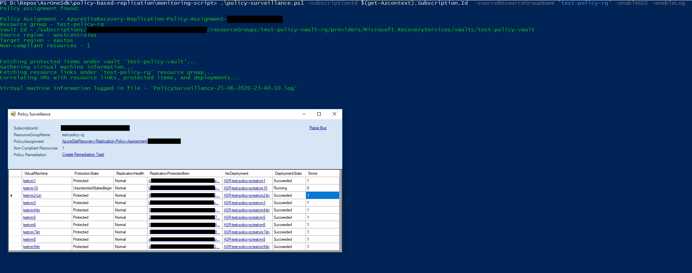

# policy-surveillance script

## prerequisites

- The script expects the user to have **'Owner'** access to the subscription passed.

## summary

- The script helps monitor the VMs in the source resource group.
- It consolidates all possible issues (validation, deployment/protection, replication health) and provides a single portal to view them all.
- It searches for ASR's policy under the resource group provided and gets all the other required information from it.
- It fetches the VMs at the source location (as per policy) and under the source resource group.
- For each of the VMs, it gathers information from corresponding resource links, protected items and deployments made by policy.
- This information is then interpreted and presented to the user ina useful manner.
  - This is either done by logging into a file, a GUI, or, in the case of both being disabled, shell output.

## parameters

- name="**_subscriptionId_**" - **Mandatory** parameter defining the subscription Id.
- name="**_sourceResourceGroupName_**" - **Mandatory** parameter defining the source resource group name. The policy assignment will be searched at this resource group's scope.
- name="**_enableLog_**" - **Optional** switch parameter indicating whether information needs to be logged into a file. **Default value used** - False.
- name="**_enableGUI_**" - **Optional** switch parameter indicating whether the user wants the information to be presented in a GUI **Default value used** - False.
- name="**_logFileLocation_**" - **Optional** parameter defining an explicit script log file location. **Default value used** - script file location.

## Example

- Only mandatory parameters (rest of the parameters are used with default values mentioned above)

```powershell
.\policy-surveillance.ps1 -subscriptionId "12341234-1234-1234-1234-123412341234" -sourceResourceGroupName "source-rg"
```

- Additional optional parameters (both logs and GUI will be enabled)

```powershell
.\policy-surveillance.ps1 -subscriptionId "12341234-1234-1234-1234-123412341234" -sourceResourceGroupName "source-rg" -enableGUI -enableLog -LogFileLocation `
  "D:\"
```

- Sample output


