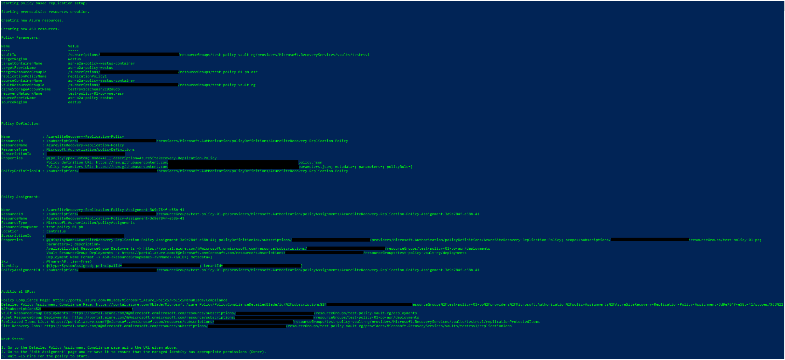

# policy-based-replication script

## prerequisites

- The script expects the user to have **'Owner'** access to the subscription passed.

## summary

- This script creates all the prerequisite resources for allowing policy based replication at scale.
- Once the resources are created, the script creates a policy definition under the subscription and further deploys a new policy assignment with appropriate parameters.
- Resource created during the script run:
  - azure
    - source resource group
      - check if resource group already exists
      - if not then
        - create resource group in source location
    - target resource group
      - check if resource group already exists
      - if not then
        - create resource group in target location
    - cache storage account
      - check if storage account already exists and in the correct location
      - if not then
        - generate name based on vault name and guid
        - create storage account in source location
    - recovery virtual network
      - check if virtual network already exists and in the correct location
      - check to ensure at least 1 subnet exists
      - if not then
        - create virtual network in target location with 1 subnet
  - asr
    - vault resource group
      - check if resource group already exists
      - if not then
        - create resource group in target location
    - vault
      - check if vault already exists and not in source location
      - if not then
        - create vault in target location
    - 2 replication fabrics
      - check if fabrics already exist for source and target location
      - if not then
        - create fabrics (asr-a2a-policy-\<location\>)
    - 2 replication protection containers
      - check if protection containers (\<fabric-name\>-container) already exist
      - if not then
        - create protection containers in above format
    - replication policy
      - check if replication already exists
      - if not then
        - create replication policy with appropriate configurations
    - 2 replication protection container mappings (source-> target, target-> source)
      - check if mapping already exists between the containers using the replication policy
      - if not then
        - create mapping (\<source-location\>-\<target-location\>-container))
  - policy
    - policy definition
      - checking if a policy definition already exists (this is all that should be needed once the policy is published)
      - if not then
        - using policy body and parameters set uploaded on github, create a new policy definition under 'Disaster Recovery'
    - policy assignment
      - checking if any policy assignments already made with the above policy definition and same scope (subscription/source resource group).
      - if above shows even 1, the user is prompted regarding this and asked whether they would like to continue or abort.
      - create a new policy assignment with important information in description.
    - role assignments
      - waiting for the service principal creation to be completed.
      - assigning role assignments (Owner) for source resource group, target resource group, and vault resource group.
- logging
  - Important information is stored in a log file which the user can refer to later.
    - This includes policy related information along with a list of additional, useful URLs, details regarding which are shared below.
  - Additional URLs shared at the end of the script run:
    - Policy Compliance Page
      - Azure portal link to the list of policy assignments made across all the user subscriptions.
    - Detailed Policy Assignment Compliance Page
      - Azure portal link to the detailed view of the policy assignment created by the script along with a list of compliant/non-compliant resources as and when policy detects them.
      - The user can use this to trigger remediation tasks if required as well as check which all VMs are compliant and which are not.
    - Vault ResourceGroup Deployments
      - Azure portal link to the list of deployments made under the vault resource group. This includes the deployments made by the policy
        - Policy deployment - default policy deployment that further makes the required deployment per VM.
        - Replication protected item deployment - ASR deployment to protect the VM. The naming convention - ASR-\<source-RG\>-\<VM-name\>-\<GUID\>
        - Recovery AvSet deployment - deployment that triggers AvSet creation, if needed.
      - The user can use this link to identify deployments made and recognize failures in case a VM doesn't show up as protected under the vault.
    - Target ResourceGroup Deployments
      - Azure portal link to the list of deployments made under the target resource group. The target RG is where the _availability sets_ will be deployed if the source VM to be protected has one. The user can use this link to check which all AvSets have been protected.
    - Replicated Items List
      - Azure portal link to the recovery services vault page listing all protected VMs under that vault.
      - The user can use this to check the VMs protected and their state.
    - Site Recovery Jobs
      - Azure portal link to the replication jobs triggered under the vault by the policy.
      - The user can use this to identify any ASR errors while protecting the VM.

## parameters

- name="**_subscriptionId_**" - **Mandatory** parameter defining the subscription Id.
- name="**_sourceResourceGroupName_**" - **Mandatory** parameter defining the source resource group name. The policy will be deployed at this resource group's scope.
- name="**_sourceLocation_**" - **Mandatory** parameter defining the source region. **Values allowed** - Full location without any spaces eg. _eastus_, _germanywestcentral_, _switzerlandnorth_ etc. Locations supported - [support_matrix](https://docs.microsoft.com/en-us/azure/site-recovery/azure-to-azure-support-matrix#region-support)
- name="**_targetLocation_**" - **Mandatory** parameter defining the target region. **Values allowed** - Full location without any spaces eg. _eastus_, _germanywestcentral_, _switzerlandnorth_ etc. Locations supported - [support_matrix](https://docs.microsoft.com/en-us/azure/site-recovery/azure-to-azure-support-matrix#region-support)
- name="**_vaultResourceGroupName_**" - **Mandatory** parameter defining the vault resource group name.
- name="**_vaultName_**" - **Mandatory** parameter defining the vault name.
- name="**_msiLocation_**" - **Mandatory** parameter defining the location where the managed services identity is deployed/created. It can be any location that the user has 'Owner' access to under the subscription in use. **Values allowed** - Full location without any spaces eg. _eastus_, _germanywestcentral_, _switzerlandnorth_ etc.
  - [What is a _managed services identity_?](https://docs.microsoft.com/en-us/azure/active-directory/managed-identities-azure-resources/overview)
  - [Why does policy require a _managed services identity_?](https://docs.microsoft.com/en-us/azure/governance/policy/how-to/remediate-resources#how-remediation-security-works)
  - What will the _managed services identity_ have access to?
    - The MSI will need to have access to the source resource group, target resource group and the vault resource group for the different deployments that need to be done.
- name="**_replicationPolicyName_**" - **Optional** parameter defining the replication policy name. **Default value used** - 24-hours-retention-policy.
- name="**_recoveryNetworkName_**" - **Optional** parameter defining the recovery network name. **Default value used** - \<sourceResourceGroupName\>-vnet-asr.
- name="**_targetResourceGroupName_**" - **Optional** parameter defining the target resource group name. **Default value used** - \<sourceResourceGroupName\>-asr.
- name="**_cacheStorageAccountName_**" - **Optional** parameter defining the [cache storage account](https://docs.microsoft.com/en-us/azure/site-recovery/azure-to-azure-how-to-enable-replication) name. **Default value used** - \<vaultName\> + cacheasr + GUID. This is trimmed down to 24 length.
- name="**_cacheStorageAccountSkuName_**" - **Optional** parameter defining the cache storage account SKU name. Values allowed - [support_matrix](https://docs.microsoft.com/en-us/azure/site-recovery/azure-to-azure-support-matrix#cache-storage). **Default value used** - Standard_LRS.
- name="**_recoverySubnetName_**" - **Optional** parameter defining a subnet name in case a new recovery network is created. **Default value used** - default.
- name="**_addressPrefix_**" - **Optional** parameter defining the address prefix range in case a new recovery network is created. This address prefix is used by the corresponding recovery subnet as well. **Default value used** - 10.0.0.0/16.
- name="**_pitRetentionInHours_**" - **Optional** parameter defining the recovery point retention in hours in case a new replication policy is created. **Default value used** - 24.
- name="**_appConsistentFrequencyInHours_**" - **Optional** parameter defining the application consistent snapshot frequency in hours, in case a new replication policy is created. **Default value used** - 24.
- name="**_logFileLocation_**" - **Optional** parameter defining an explicit script log file location. **Default value used** - script file location.

## Example

- Only mandatory parameters (rest of the parameters are used with default values mentioned above)

```powershell
.\policy-based-replication.ps1 -subscriptionId "12341234-1234-1234-1234-123412341234" -sourceResourceGroupName "source-rg" -sourceLocation "eastus" -targetLocation "westus" -vaultResourceGroupName "vault-rg" -vaultName "vault1" -msiLocation "centralus"
```

- Additional optional parameters (rest of the parameters are used with default values mentioned above)

```powershell
.\policy-based-replication.ps1 -subscriptionId "12341234-1234-1234-1234-123412341234" -sourceResourceGroupName "source-rg" -sourceLocation "eastus" -targetLocation "westus" -vaultResourceGroupName "vault-rg" -vaultName "vault1" -msiLocation "centralus" -replicationPolicyName "replicationPolicy1" -addressPrefix "10.0.0.0/16" -cacheStorageAccountName "cachesa"
```

- Sample output


